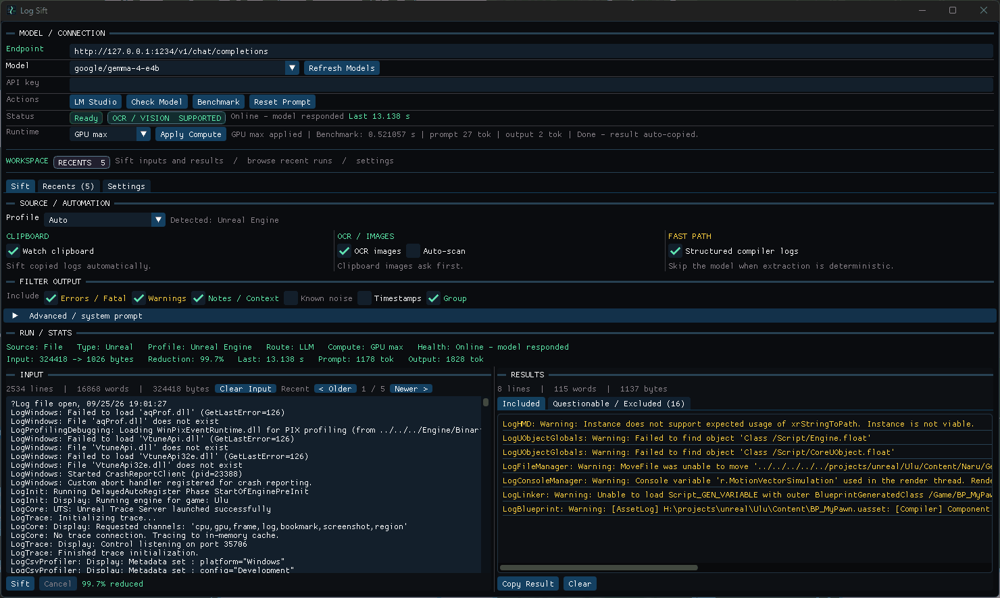
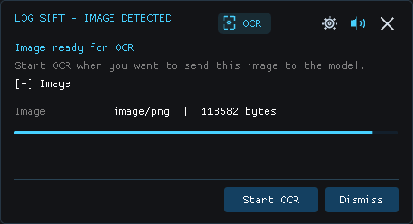
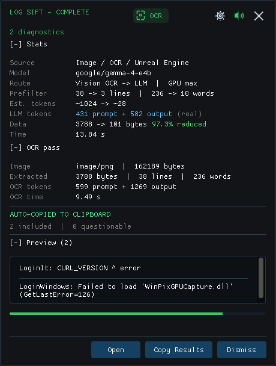
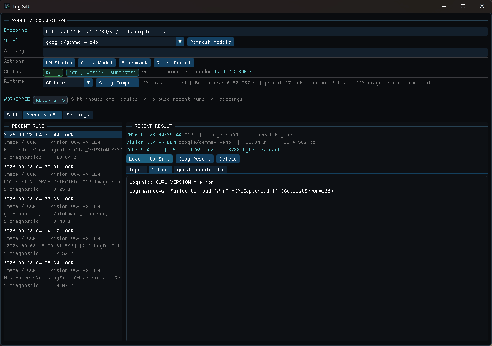

# Log Sift

Log Sift is a small desktop utility for turning noisy build and runtime logs into the diagnostics you actually need.

Copy a log, drop a file, or snip a screenshot. Log Sift prefilters the noise locally, optionally asks an OpenAI-compatible model to refine the result, and gives you a compact set of errors/warnings you can paste somewhere useful.

<p align="center">
  
</p>

## Highlights

- **Clipboard-first:** watch copied logs automatically, with tray/menu-bar controls.
- **Fast local filtering:** structured compiler logs can skip the model entirely.
- **Optional LLM refinement:** uses an OpenAI-compatible chat-completions endpoint such as LM Studio.
- **Screenshot OCR:** PNG/JPG clipboard images and dropped images can be transcribed by vision-capable models before normal log sifting.
- **Offline fallback:** model failures do not prevent local diagnostic extraction.
- **Useful popups:** scan progress, route/model stats, OCR stats, result preview, mute/open controls, and configurable timers.
- **Recents:** persistent input/output history with configurable retention and reload/copy controls.
- **Profiles:** editable JSON profiles for different log formats.
- **Windows + macOS:** native tray/menu-bar integration and start-at-login support.

## OCR workflow

Clipboard images can scan immediately, or Log Sift can ask before sending the image to the configured vision model.

<table>
  <tr>
    <td width="50%" align="center">
      
    </td>
    <td width="50%" align="center">
      
    </td>
  </tr>
  <tr>
    <td align="center"><sub>Confirm OCR before the image is sent.</sub></td>
    <td align="center"><sub>OCR timing/tokens, sift stats, and the final diagnostics in one popup.</sub></td>
  </tr>
</table>

The vision pass feeds extracted text back through the normal Log Sift pipeline:

```text
image -> OCR text -> local prefilter -> optional model sift -> result
```

## Recents

Log Sift keeps a small persistent history of recent inputs and outputs (5 by default). Cycle through them from the Sift view or inspect, reload, copy, and delete them from the Recents tab.

<p align="center">
  
</p>

## Quick start

1. Build and launch Log Sift.
2. Point **Endpoint** at an OpenAI-compatible chat-completions endpoint.
3. Pick a model and click **Check Model**.
4. Enable **Watch clipboard**.
5. Copy a log.

If the selected model accepts image input, the health check marks **OCR / VISION** as supported. Text-only models still work normally.

## Build

Requirements are fetched by CMake: SDL3, Dear ImGui, and nlohmann/json.

### Windows

```powershell
cmake -S . -B build -G Ninja -DCMAKE_BUILD_TYPE=Release
cmake --build build
.\build\logsift.exe
```

### macOS

```bash
cmake -S . -B build -G Ninja -DCMAKE_BUILD_TYPE=Release
cmake --build build
open "build/Log Sift.app"
```

The executable target is `logsift`. Bundled profiles are copied beside the executable and seeded into the user's editable profile directory on first run.

## CLI

The desktop app is optional for normal text filtering.

```text
logsift --cli [FILE|-] [options]
logsift --image IMAGE [options]
```

Common examples:

```bash
# Local/deterministic filtering
logsift --cli build.log

# stdin
cat build.log | logsift --cli -

# Structured output
logsift --cli build.log --json

# Use the model configured by the desktop app
logsift --cli build.log --llm

# OCR a screenshot, then sift the extracted log text
logsift --image screenshot.png --json

# See installed profiles
logsift --list-profiles
```

Run `logsift --help` for the full option list. CLI model/OCR runs use the saved endpoint, model, and API key unless `--endpoint` or `--model` overrides them.

## Model endpoint

Log Sift talks to an OpenAI-compatible chat-completions endpoint. The default is LM Studio:

```text
http://127.0.0.1:1234/v1/chat/completions
```

The health check verifies the selected model and separately probes image input support instead of guessing from the model name.

## Data and settings

Persistent data lives in:

- Windows: `%USERPROFILE%\.logsift\`
- macOS: `~/.logsift/`

Typical contents:

- `settings.json` — model, filters, clipboard/OCR, popup, sound, and UI behavior.
- `recents.json` — recent sift input/output history.
- `profiles/` — editable log profiles.

Bundled profile updates seed missing files without overwriting your edited copies.

## Desktop workflow

Log Sift is designed to stay out of the way:

- Closing/hiding the main window leaves the tray/menu-bar app available.
- Only one instance runs; relaunching brings the existing instance forward.
- Clipboard text can be auto-sifted.
- Clipboard images can auto-scan or ask before OCR.
- Dropped `.log`, `.txt`, `.png`, `.jpg`, and `.jpeg` files are supported.
- Actionable results can be auto-copied.
- Notification sounds can be muted from the popup or tray/menu-bar menu.
- The gear on a popup opens the main app.

## Exit codes

For CLI use:

- `0` — diagnostics returned
- `1` — no diagnostics
- `2` — invalid arguments or input
- `3` — explicitly requested model/OCR processing failed
